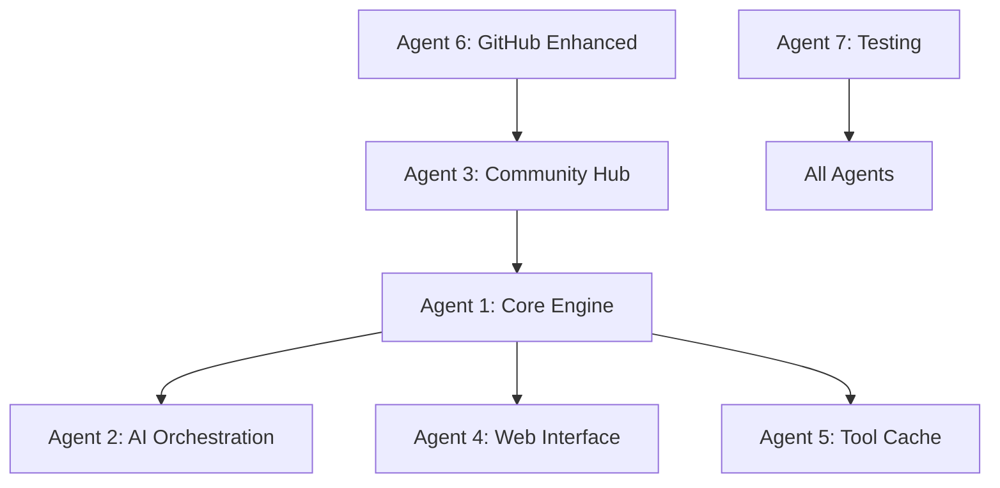

# MCP Orchestration Hub - AI-Native Development Architecture

## 🎭 Project Overview

**Vision**: Build the world's first **Local MCP Orchestration Hub** using distributed AI development with parallel Claude Opus 4 agents working on independent feature branches.

## 🏗️ Architecture: AI Agent Distribution

### **Main Coordinator**: Claude Sonnet 4 (Integration & Orchestration)
**Role**: Project management, integration testing, final review
**Branch**: `main` (integration branch)

### **Development Agents**: Claude Opus 4 (Feature Development)

#### **Agent 1: Core Engine Developer**
- **Branch**: `feature/mcp-hub-core`
- **Responsibility**: MCP Conductor, Server Registry, Capability Indexing
- **Deliverables**: Core orchestration engine, MCP server management
- **Timeline**: Week 1
- **Dependencies**: None (foundation layer)

#### **Agent 2: AI Intelligence Developer**  
- **Branch**: `feature/ai-orchestration`
- **Responsibility**: LLM-powered routing, intent analysis, capability matching
- **Deliverables**: Intelligent request routing, AI tool generation
- **Timeline**: Week 2
- **Dependencies**: Core Engine (Agent 1)

#### **Agent 3: Community Integration Developer**
- **Branch**: `feature/community-hub` 
- **Responsibility**: GitHub integration, marketplace, server discovery
- **Deliverables**: Community server search, one-click installation
- **Timeline**: Week 3
- **Dependencies**: Core Engine (Agent 1)

#### **Agent 4: Web Interface Developer**
- **Branch**: `feature/web-dashboard`
- **Responsibility**: Real-time dashboard, management interface
- **Deliverables**: Live capability matrix, server status, tool builder
- **Timeline**: Week 2
- **Dependencies**: Core Engine (Agent 1)

#### **Agent 5: Tool Cache Developer**
- **Branch**: `feature/tool-cache`
- **Responsibility**: Interactive tool caching, management system
- **Deliverables**: Tool storage, quick-launch system, metadata management
- **Timeline**: Week 2
- **Dependencies**: Core Engine (Agent 1)

#### **Agent 6: GitHub Enhancement Developer**
- **Branch**: `feature/github-enhanced`
- **Responsibility**: Advanced Git operations, automated deployment
- **Deliverables**: Local Git integration, automated publishing workflows
- **Timeline**: Week 1
- **Dependencies**: None (parallel with core)

#### **Agent 7: Testing & QA Engineer**
- **Branch**: `feature/testing-suite`
- **Responsibility**: Comprehensive testing, validation, documentation
- **Deliverables**: Test suite, integration tests, performance benchmarks
- **Timeline**: Continuous
- **Dependencies**: All other agents

## 📁 Project Structure

```
mcp-orchestration-hub/
├── README.md                          # Project overview and setup
├── ARCHITECTURE.md                    # Technical architecture doc
├── AI-AGENTS.md                       # Agent coordination guide
├── package.json                       # Project metadata and scripts
├── .gitignore                         # Git ignore rules
├── .github/                          # GitHub workflows and templates
│   ├── workflows/
│   │   ├── ai-agent-integration.yml   # AI agent coordination workflow
│   │   ├── feature-branch-testing.yml # Automated testing per branch
│   │   └── integration-testing.yml    # Cross-branch integration tests
│   ├── ISSUE_TEMPLATE/
│   │   ├── agent-task.md              # Template for agent assignments
│   │   └── integration-request.md     # Template for integration requests
│   └── pull_request_template.md       # PR template for agent reports
├── docs/                              # Documentation
│   ├── api/                          # API documentation
│   ├── agents/                       # Agent-specific docs
│   └── deployment/                   # Deployment guides
├── src/                              # Source code (organized by agent)
│   ├── core/                         # Agent 1: MCP Hub Core
│   │   ├── mcp-conductor.js
│   │   ├── server-registry.js
│   │   └── capability-index.js
│   ├── ai-orchestration/             # Agent 2: AI Intelligence
│   │   ├── intent-analyzer.js
│   │   ├── capability-matcher.js
│   │   └── intelligent-router.js
│   ├── community/                    # Agent 3: Community Hub
│   │   ├── github-integration.js
│   │   ├── marketplace.js
│   │   └── server-discovery.js
│   ├── webapp/                       # Agent 4: Web Interface
│   │   ├── dashboard/
│   │   ├── components/
│   │   └── api/
│   ├── tool-cache/                   # Agent 5: Tool Cache
│   │   ├── cache-manager.js
│   │   ├── tool-launcher.js
│   │   └── metadata-system.js
│   ├── github-enhanced/              # Agent 6: GitHub Enhancement
│   │   ├── git-operations.js
│   │   ├── deployment-automation.js
│   │   └── release-management.js
│   └── shared/                       # Shared utilities
│       ├── mcp-client.js
│       ├── logger.js
│       └── config-manager.js
├── tests/                            # Agent 7: Testing Suite
│   ├── unit/                        # Unit tests per component
│   ├── integration/                  # Integration tests
│   ├── e2e/                         # End-to-end tests
│   └── performance/                  # Performance benchmarks
├── extensions/                       # MCP Server Extensions
│   ├── windows-command-enhanced/     # Enhanced base server
│   └── quick-tools-cache/           # Tool caching extension
├── tools/                           # Development tools
│   ├── ai-agent-coordinator.js      # Agent management scripts
│   ├── branch-manager.js            # Branch automation
│   └── integration-tester.js        # Integration testing tools
└── deployments/                     # Deployment configurations
    ├── local/                       # Local development setup
    ├── cloud/                       # Cloud deployment configs
    └── docker/                      # Container configurations
```

## 🤖 AI Agent Coordination Protocol

### **Agent Assignment Process**

#### **1. Task Distribution**
```yaml
# .github/workflows/ai-agent-coordination.yml
name: AI Agent Task Distribution
on:
  push:
    branches: [main]
  issue:
    types: [opened]

jobs:
  assign-to-agent:
    runs-on: ubuntu-latest
    steps:
      - name: Analyze Task Requirements
      - name: Identify Optimal Agent
      - name: Create Feature Branch
      - name: Assign Agent to Branch
      - name: Set Up Development Environment
```

#### **2. Agent Work Protocol**
Each agent follows this standardized process:

1. **Branch Setup**: Checkout assigned feature branch
2. **Requirements Analysis**: Review task specification
3. **Implementation**: Build assigned features
4. **Testing**: Validate functionality
5. **Documentation**: Update relevant docs
6. **Integration Request**: Submit PR with status report

#### **3. Status Reporting Format**
```markdown
## Agent Status Report

**Agent ID**: Agent 1 (Core Engine Developer)
**Branch**: feature/mcp-hub-core
**Task**: MCP Conductor Implementation
**Status**: ✅ Complete / 🔄 In Progress / ⚠️ Blocked

### Completed Items
- [x] MCP Conductor base architecture
- [x] Server registry implementation
- [x] Capability indexing system

### Current Progress
- [x] 90% - Core orchestration engine
- [x] 75% - Server management interface
- [x] 60% - Capability discovery system

### Blockers
- None currently

### Integration Requirements
- Depends on: None
- Required by: Agent 2 (AI Orchestration), Agent 4 (Web Interface)

### Next Steps
1. Complete capability indexing
2. Add error handling
3. Prepare for Agent 2 integration

### Code Quality
- Tests: ✅ All passing
- Documentation: ✅ Complete
- Performance: ✅ Benchmarked
```

## 🔄 Integration Workflow

### **Continuous Integration Process**

#### **Phase 1: Individual Agent Development**
- Each agent works independently on feature branch
- Automated testing on every commit
- Daily status reports via GitHub issues
- Coordinator monitors progress via dashboard

#### **Phase 2: Cross-Agent Integration**
- Agents submit integration requests
- Coordinator reviews compatibility
- Automated integration testing
- Conflict resolution and coordination

#### **Phase 3: Final Integration**
- All agents report completion
- Comprehensive integration testing
- Performance validation
- Production deployment

### **Agent Communication Protocol**

#### **Inter-Agent Dependencies**


#### **Coordination Meetings**
- **Daily**: Automated status sync via GitHub
- **Weekly**: Agent coordination review
- **Integration**: Cross-agent compatibility check

## 🎯 Success Metrics

### **Individual Agent KPIs**
- **Code Quality**: Test coverage > 90%
- **Performance**: Meet specified benchmarks
- **Documentation**: Complete API and usage docs
- **Timeline**: Deliver within assigned timeframe

### **Integration Success**
- **Compatibility**: All agents integrate successfully
- **Performance**: System meets performance targets
- **Functionality**: All features work as designed
- **User Experience**: Seamless end-to-end workflow

## 🚀 Deployment Strategy

### **Development Environment**
```bash
# Clone repository
git clone https://github.com/thebacons/claude-desktop-extensions.git
cd claude-desktop-extensions/mcp-orchestration-hub

# Setup for agent development
npm install
npm run setup-agent-env

# Assign agent to branch (automated)
npm run assign-agent --agent-id=1 --branch=feature/mcp-hub-core
```

### **Agent Development Commands**
```bash
# Start agent development session
npm run agent-start --agent-id=1

# Run agent-specific tests
npm run test-agent --agent-id=1

# Submit integration request
npm run submit-integration --agent-id=1

# Coordinate with other agents
npm run sync-agents
```

## 📊 Monitoring & Metrics

### **Real-Time Agent Dashboard**
- Agent status and progress
- Code commits and quality metrics
- Integration readiness indicators
- Performance benchmarks
- Dependency tracking

### **Automated Reporting**
- Daily progress reports
- Integration compatibility checks
- Performance regression alerts
- Code quality assessments

## 🎭 The Revolutionary Aspect

This project represents the **first large-scale AI-native software development** where:

1. **Multiple AI Agents** work in parallel on complex features
2. **Automated Coordination** manages dependencies and integration
3. **Real-time Monitoring** tracks progress and quality
4. **Intelligent Integration** handles conflicts and optimization
5. **Community Building** enables ecosystem growth

**This isn't just building software - it's pioneering the future of AI-collaborative development!** 🚀

---

**Ready to deploy the agents?** The structure is designed for immediate AI agent assignment and parallel development across all features.
